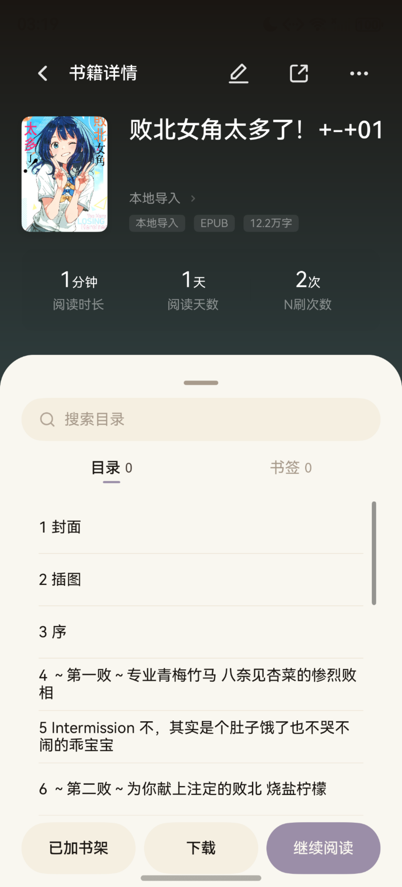
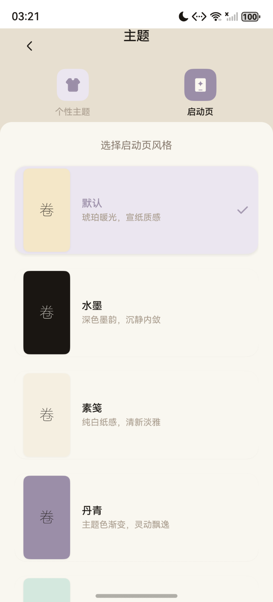
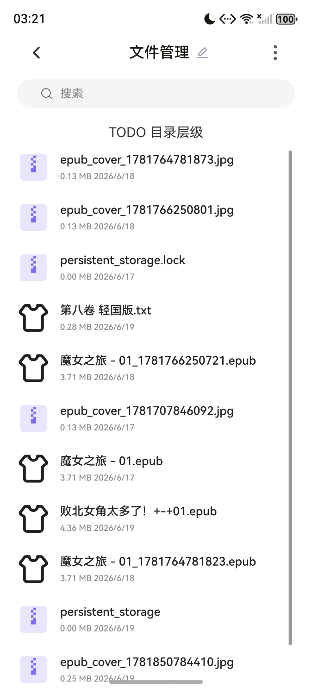
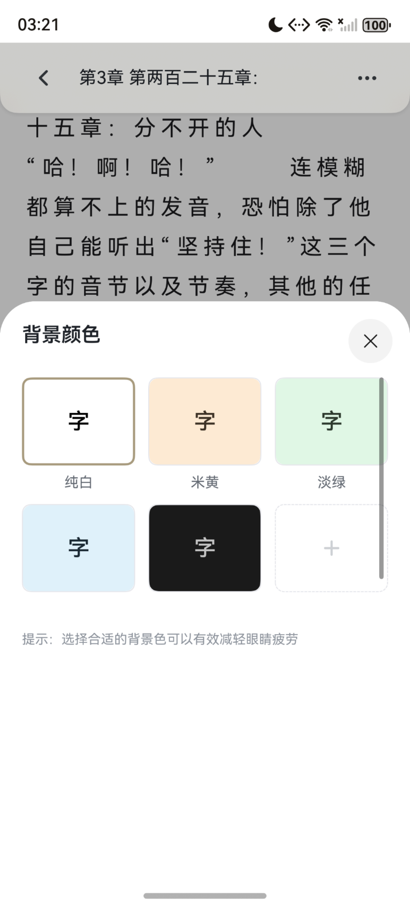
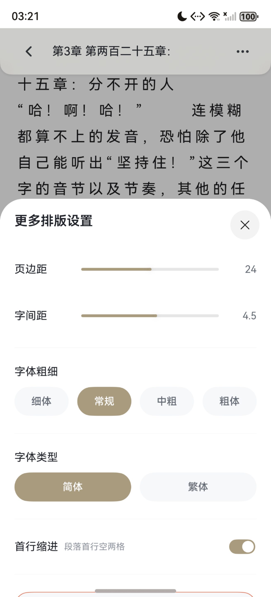
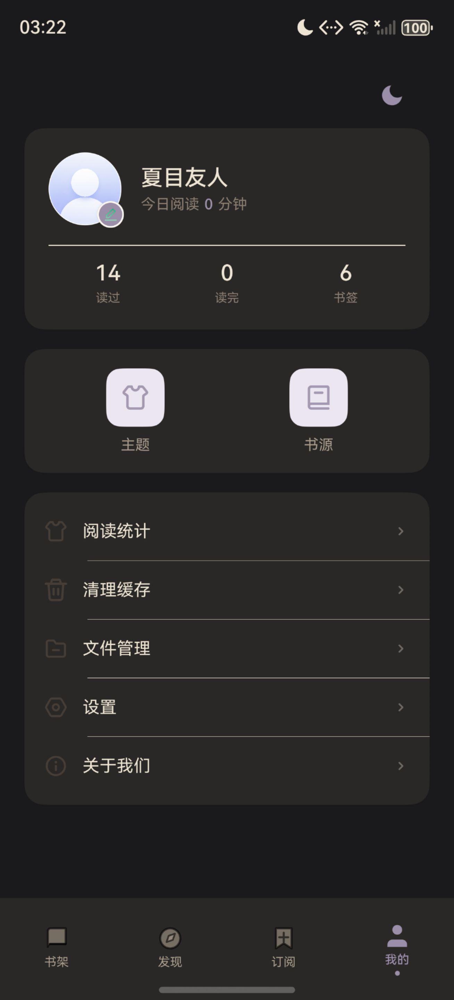
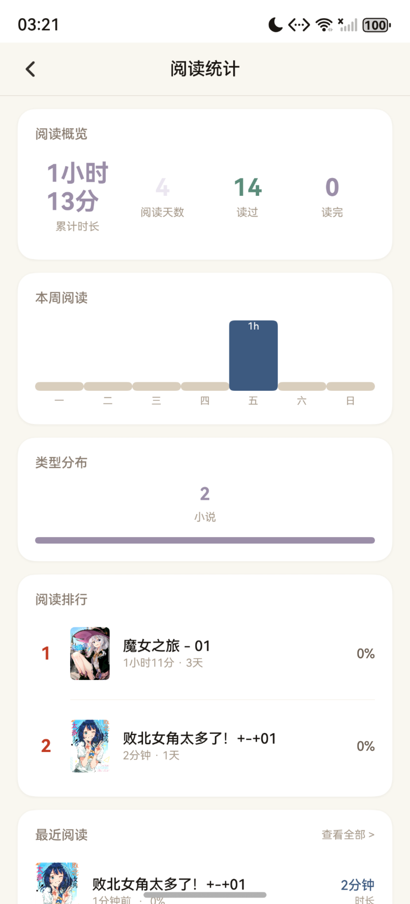
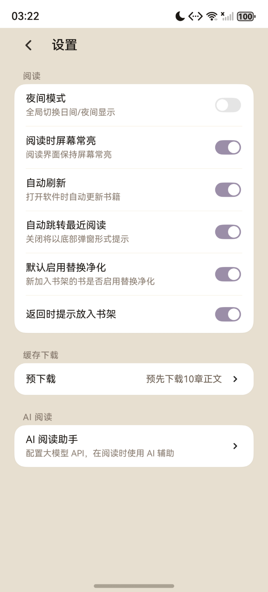

# BookMind - 鸿蒙智能阅读应用

<p align="center">
  
</p>

<p align="center">
  <strong>基于 HarmonyOS 6.0 的全功能电子书阅读器，融合 AI 智能助手与东方文人美学</strong>
</p>

<p align="center">
  
  
</p>

---

## 简介

BookMind（鸿蒙阅读）是一款基于鸿蒙操作系统的智能阅读应用，以 Android 平台知名开源阅读应用"Legado"为参考，将其核心功能移植到鸿蒙平台，并在此基础上进行了大量创新和优化。

**核心特色：**

- **书源抓取引擎** -- 兼容 Legado 规则生态，支持 CSS / JSON Path / Regex 多规则解析
- **四种翻页动画** -- 覆盖翻页、仿真翻页、滑动翻页、上下滚动
- **墨韵设计系统** -- 东方文人美学 x HarmonyOS 6.0 圆角设计语言，10 套莫兰迪主题
- **AI 阅读助手** -- OpenAI 兼容 API，ReAct 多轮推理，自动获取阅读上下文
- **双阅读器架构** -- ReaderKit 原生 + 自绘 Canvas 自适应切换

---

## 功能展示

### 书架

<p align="center">
  
</p>

支持分组管理、网格/列表视图切换、批量管理。顶部 Tab 支持小说/漫画分类筛选。

### 在线书源

<p align="center">
  
</p>

集成多个在线书源，支持按榜单浏览，也可通过搜索框跨书源聚合搜索。

### 书籍详情

<p align="center">
  
</p>

展示封面、阅读统计，支持目录浏览、书签管理和缓存下载。

### 阅读界面

<p align="center">
  
  
</p>

支持 EPUB 图文混排和在线小说内容渲染，日间/夜间模式一键切换。

### 翻页模式

<p align="center">
  
</p>

四种翻页动画：覆盖翻页、仿真翻页（Canvas Bezier 卷页）、滑动翻页、上下滚动。

### AI 阅读助手

<p align="center">
  
  
  
</p>

集成 OpenAI 兼容大模型，ReAct 多轮推理模式：SSE 流式对话、5 个内置工具（获取前文/后文/本章/指定章节/目录）、会话持久化、Markdown 渲染。

### AI 设置

<p align="center">
  
</p>

支持配置模型名称、API Key、Token 限制、温度参数、系统提示词，可开启/关闭智能工具和思考模式。

### 主题系统

<p align="center">
  
</p>

10 套莫兰迪色系预设主题：烟粉、雾蓝、枯荷、松绿、藕紫、琥珀、灰蓝、柿红、青灰、墨竹。支持自定义主题。

### 夜间模式

<p align="center">
  
  
</p>

全局夜间模式，沉浸式系统栏，所有页面统一适配。

### 书签管理

<p align="center">
  
</p>

支持任意位置添加书签，按书籍筛选，批量删除，点击跳转阅读位置。

### 阅读统计

<p align="center">
  
</p>

阅读概览、本周活跃度、类型分布、阅读排行、最近阅读。

### 设置

<p align="center">
  
</p>

集成夜间模式、屏幕常亮、自动刷新、跳转最近阅读、替换净化、预下载等阅读偏好配置。

### 下载管理

<p align="center">
  
  
</p>

支持章节缓存下载，提供多种缓存策略：缓存后 50 章、缓存全部、自定义范围。下载进度实时显示。

---

## 技术架构

### 模块结构

```
BookMind-Harmony/
├── entry/                          # 主应用模块
│   ├── src/main/ets/
│   │   ├── entryability/           # 应用入口，生命周期管理
│   │   ├── pages/                  # 32 个路由页面
│   │   ├── componets/              # 可复用 UI 组件
│   │   ├── database/               # RDB 数据库层（20+ 表）
│   │   ├── common/
│   │   │   ├── constants/          # 设计令牌、主题、常量
│   │   │   ├── model/              # 内容分析管道（规则引擎）
│   │   │   └── utils/              # 工具类（文件、网络、解析等）
│   │   └── storage/                # AppStorage 状态初始化
│   └── web/                        # 嵌入式 Vue 3 Web 应用
├── readerLibrary/                  # 阅读器引擎模块
│   └── src/main/ets/
│       ├── view/                   # 翻页视图（Cover/Slide/Curl/UpDown）
│       ├── provider/               # 阅读状态管理（Provider 链）
│       └── common/                 # 实体类、分页辅助工具
└── commons/colorLibrary/           # 颜色工具库（预留）
```

### 技术栈

| 类别 | 技术 |
|------|------|
| 开发语言 | ArkTS（HarmonyOS 声明式 UI） |
| 开发工具 | DevEco Studio 5.0 |
| 构建工具 | hvigor 5.0.0 |
| 包管理 | ohpm |
| 网络请求 | @ohos/axios（GET）+ http.createHttp（POST） |
| 数据库 | relationalStore（RDB/SQLite） |
| 渲染引擎 | Canvas 自绘 + DrawingRenderingContext |
| 异步计算 | taskPool 线程池 |

### 设计系统 -- "墨韵" 2.0

东方文人美学 x HarmonyOS 6.0 圆角设计语言：

- **纸色系列**（6 级）-- 从暖白 `#FAF7F0` 到沙色 `#D9CEBD`
- **墨色系列**（8 级）-- 从浓墨 `#1A1612` 到薄雾 `#C5BAB0`
- **强调色** -- 朱砂红、青瓷绿、琥珀金、靛蓝、檀木棕
- **10 套莫兰迪主题** -- 烟粉、雾蓝、枯荷、松绿、藕紫等

---

## 快速开始

### 环境要求

- DevEco Studio 5.0+
- HarmonyOS SDK 5.0.0(12)+（API 12）
- HarmonyOS 5.0+ 设备

### 运行步骤

1. 克隆项目
   ```bash
   git clone https://github.com/wumingking-123/BookMind-Harmony.git
   ```
2. 使用 DevEco Studio 打开项目根目录
3. 等待 ohpm 依赖安装完成
4. 连接鸿蒙设备或启动模拟器
5. 点击 Run 运行应用

---

## 支持格式

| 格式 | 状态 | 说明 |
|------|------|------|
| TXT | 完整支持 | 自动编码识别（UTF-8/GBK/GB2312/GB18030），智能分章 |
| EPUB | 完整支持 | 目录解析、图文混排、封面提取 |
| CBZ | 完整支持 | ZIP 解压、图片排序、每页生成章节 |
| 在线书籍 | 完整支持 | 书源规则抓取，多书源聚合搜索 |
| CBR/CB7 | 格式提示 | 需转为 CBZ 使用 |
| PDF | 部分支持 | 仅 ReaderKit 原生设备可能渲染 |

---

## 项目亮点

1. **AI 与阅读融合** -- ReAct 模式实现智能助手，自动获取上下文提供精准问答
2. **东方美学设计** -- 中国传统美学元素融入现代 UI，莫兰迪色彩理论生成和谐配色
3. **多规则引擎** -- CSS/JSON Path/Regex/Legado 四种规则格式，完全兼容 Legado 生态
4. **双阅读器自适应** -- 根据设备能力自动选择 ReaderKit 原生或自绘 Canvas 阅读器
5. **高性能分页** -- taskPool 异步分页计算，预加载相邻章节，60fps 流畅翻页
